**ClassX: Installation and Setup Guide for Linux Users**

## 1\. Introduction

This guide provides a detailed, step-by-step process for installing and configuring the ClassX Tool on Linux-based systems (tested on Ubuntu). ClassX is an AI-powered web platform developed by NASA’s STC Center to support researchers in labeling and analyzing advanced geospatial datasets, specifically Arctic sea ice and solar image data. The system uses an architecture with Docker containers for portability and efficient deployment.

The ClassX Tool includes several integrated components:

 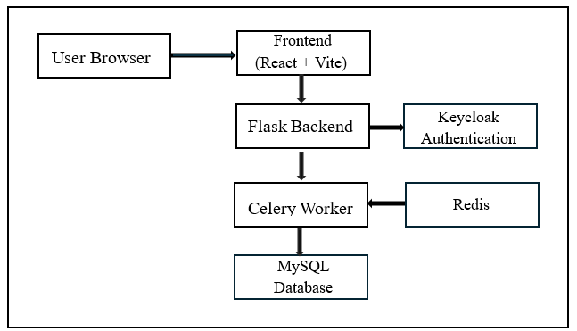

ClassX System Design

1.  **Frontend (React + Vite):** Delivers a responsive user interface for interacting with geospatial data and tools.
2.  **Backend (Flask API):** Manages all logic, task execution, and database interactions.
3.  **MySQL Database:** Stores labeled data, configurations, and user accounts.
4.  **Authentication Service (Keycloak):** Handles user login, session management, and role-based access.
5.  **Task Queue (Celery + Redis):** Performs asynchronous background processing such as segmentation and labeling.
6.  **Segmentation Model (Mask-RCNN):** Executes AI-based image labeling workflows within an isolated container.

## 2\. System Requirements and Tested Versions

Before beginning the installation, ensure your system meets the following basic requirements. These tools are necessary to set up and run the ClassX application using Docker containers.

**Tested Versions**

The installation steps in this guide have been verified using the following versions:

| Tool | Version |
| --- | --- |
| Git | 2.34.1 |
| Docker Engine | 28.1.1, build 4eba377 |
| Docker Compose | v2.35.1 |

Using these or later versions is recommended for a smooth setup experience.  

## 3\. Install Prerequisites

This section guides you through installing the required tools to run ClassX on your Ubuntu system. These include Git, Docker, Docker Compose, and Make.

**Important:** All commands in this guide are intended to be run with sudo. If you’re not logged in as root, prefix each command with sudo or switch to root using

```bash
sudo su –l
```

**Step 1: Update Package Lists**

Open a terminal and update your system’s package index to ensure you get the latest versions:

```bash
sudo apt update
```

**Step 2: Install Required Packages**

Install Git, Docker, Docker Compose plugin, and Make:

```bash
sudo apt install -y git docker.io docker-compose-plugin make
```

**Step 3: Set up Docker's apt repository**

Set the Docker packages using the following commands:

```bash
# Add Docker's official GPG key:
sudo apt-get update
sudo apt-get install ca-certificates curl
sudo install -m 0755 -d /etc/apt/keyrings
sudo curl -fsSL https://download.docker.com/linux/ubuntu/gpg -o /etc/apt/keyrings/docker.asc
sudo chmod a+r /etc/apt/keyrings/docker.asc

# Add the repository to Apt sources:
echo \
  "deb [arch=$(dpkg --print-architecture) signed-by=/etc/apt/keyrings/docker.asc] https://download.docker.com/linux/ubuntu \
  $(. /etc/os-release && echo \"${UBUNTU_CODENAME:-$VERSION_CODENAME}\") stable" | \
  sudo tee /etc/apt/sources.list.d/docker.list > /dev/null

sudo apt-get update
```


**Step 4: Install the Docker packages**

Install the latest version of Docker


```bash
sudo apt-get install docker-ce docker-ce-cli containerd.io docker-buildx-plugin docker-compose-plugin
```

**Step 5: Enable and Start Docker**

Set Docker to start automatically when your system boots:

```bash
sudo systemctl enable docker
```

```bash
sudo systemctl start docker
```

To confirm Docker is running, check its status:

```bash
sudo systemctl status docker
```

 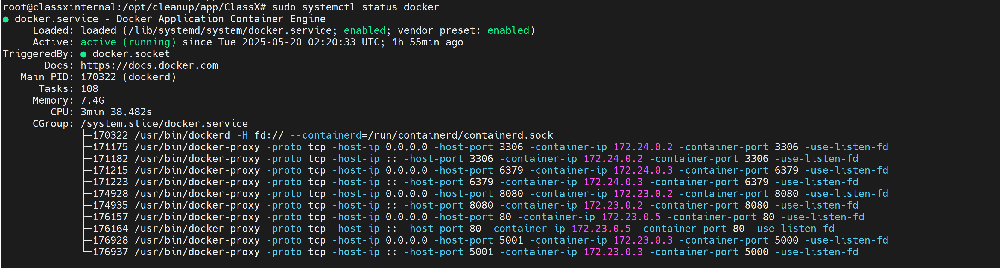

You should see the status as “active (running)”.

**Step 6: Verify Installations**

Ensure all required tools are correctly installed:
```bash
git --version
```

 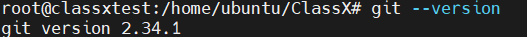

```bash
 docker --version
```
 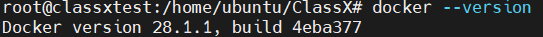

 ```bash
docker compose version
```
 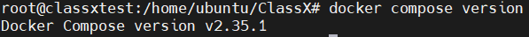
 
make --version

 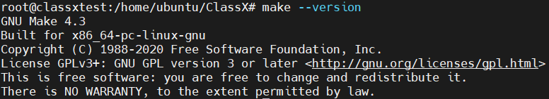
 
If each command returns an exact version number or a later version number, the installation is complete.

## 4\. Authenticate with GitHub and Docker (if required)

You may need to log in to GitHub and Docker to download private container images or interact with version-controlled repositories.

**Step 1: GitHub Configuration (for Git access)**

If this is your first time using Git on this system, configure your Git identity:

```bash
git config --global user.name “Your Name”
```

```bash
git config --global user.email “you@example.com”
```

This ensures your commits and activities are associated with your GitHub account.

**Step 2: Docker Login (for Private Container Registry)**

Run the following command to log in:

```bash
docker login ghcr.io
```

You will be prompted to enter your GitHub username and personal access token.

## 5\. Clone the Repository and Set Up the Environment File

This step involves downloading the ClassX project files and configuring the environment necessary to run the application.

**Step 1: Clone the Repository**

In your terminal, navigate to the directory where you want to store the project, then run:

```bash
git clone https://github.com/stccenter/ClassX.git
```

Navigate to the ClassX directory.

```bash
cd ClassX
```

**Step 2: Create the Environment File**

ClassX requires an .env file that holds important configuration settings such as database credentials, authentication settings, and API URLs.

Start by copying the example file:

```bash
cp .env.example .env
```

**Step 3: Modify the .env file**

Open .env in any text editor and update the following variables in the .env file as per your set up.

DB_USER

DB_PASSWORD

MYSQL_ROOT_PASSWORD

FLASK_SECRET_KE

JWT_SECRET_KEY

FRONTEND_URL

NEXT_PUBLIC_API_URL

NEXT_DEFAULT_API_BASE_URL

VITE_SRC_URL

Note: FRONTEND_URL, NEXT_PUBLIC_API_URL, NEXT_DEFAULT_API_BASE_URL, VITE_SRC_URL with your actual server IP or domain name (use localhost for local testing)

Once your .env file is ready, save and close it.  

## 6\. Build and Run ClassX Using Docker Compose

After setting up your .env file and installing all prerequisites, follow the steps below to either build or pull the ClassX Docker images and start the application.

**Step 1: Bring up the ClassX applications**

The ClassX project includes a Makefile that simplifies commonly used Docker commands. This file makes container management easier by allowing you to build, start, stop, or reset the application without manually typing extensive Docker commands.

**Makefile Commands**

| Command | Description |
| --- | --- |
| make build | Build all Docker containers from source using the .env configuration |
| make up | Starts all ClassX services in detached mode (-d) |
| make down | Stops and removes all running containers and associated volumes |
| make reset | Performs a complete teardown and restarts the system from a clean state |

Note: These commands should be executed from the root directory of the ClassX project, where the Makefile is located.

Run the command below to build all containers:

```bash
make build
```

Run the command below to launch the application:

```bash
make up
```

**Step 2: Verify Running Containers**

First, we need to make sure all the containers are healthy by using the following command:

```bash
docker ps
```
 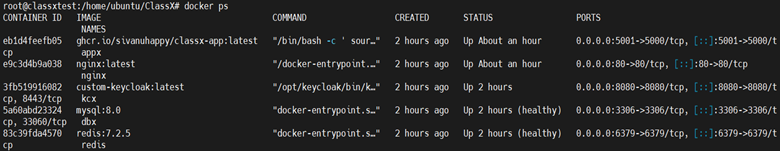

You should see entries for the following containers:

1.  appx – Flask backend
2.  kcx – Keycloak authentication server
3.  dbx – MySQL database
4.  redis – Message broker
5.  celery – Background task handler
6.  nginx-react – React frontend served via NGINX

If all containers are listed and running, the system is now active.

**Step 3: Check Docker logs**

Refer to the following table for commands.

| Command | Description |
| --- | --- |
| docker logs -f kcx | Check Keycloak container logs. |
| docker logs -f appx | Check App container logs. |
| docker logs -f nginx | Check Nginx container logs. |
| docker logs -f dbx | Check Database container logs |
| docker logs -f redis | Check Redis container logs. |

## 7\. Configure Keycloak Authentication

Keycloak is used in ClassX to manage user authentication, secure access, and role-based authorization. In this step, you will access the Keycloak admin interface, create a realm, and configure OAuth client settings that allow the frontend and backend to authenticate users.

**Step 1: Keycloak login**

In your browser, navigate to:

http://<your-ip-address>/keycloak

This should bring up the Keycloak admin login page. The login details are admin, and the password is what you set in the environment variables.  

 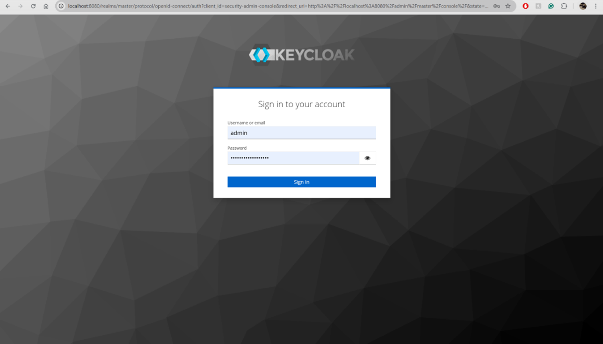

**Step 2: Configure Keycloak Realm routes**
From the drop-down menu, click on your realm and select STC-ClassX. Then, click on “Clients” and you should see the “flask-app” and “admin-api” clients.

 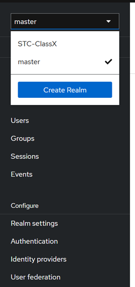

 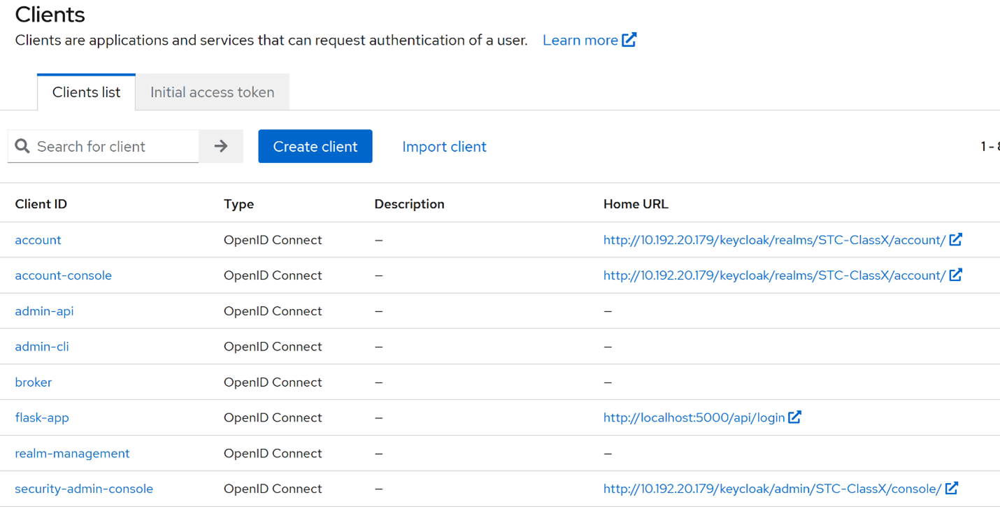
 
**Step 3: Add redirect URI**
Click on ‘flask-app’, then navigate to ‘Valid redirect URIs’. Click on ‘Add valid redirect URIs’ and insert http://<IP address>/callback. Similarly, navigate to the “Valid post logout redirect URIs” and insert http://<IP address>/callback.

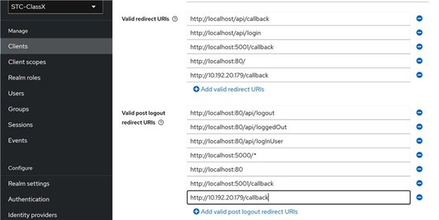

**Step 4: Sign in to the ClassX application**
You can navigate to the application at http://<youripaddress>/, where the front page should open. Then, click the drop-down menu in the top right corner and select “SIGN IN”.

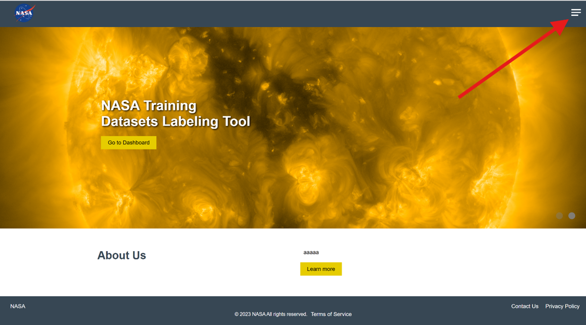

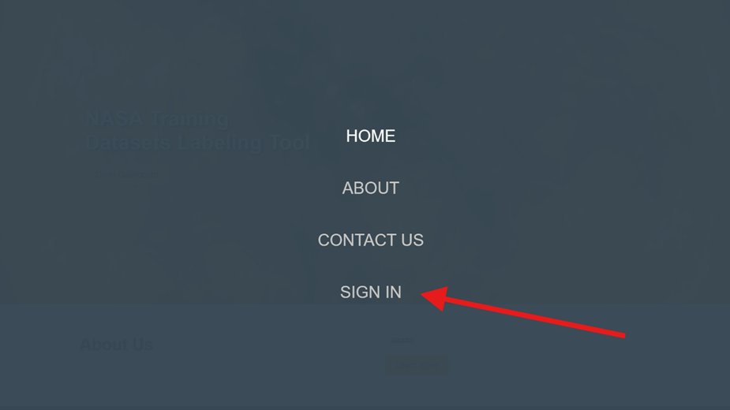

**Step 5: Register and Sign in**

The page should be redirected to Keycloak’s login page, where you will need to register and then sign in. If the image view page loads, then the system is set up and installed correctly.

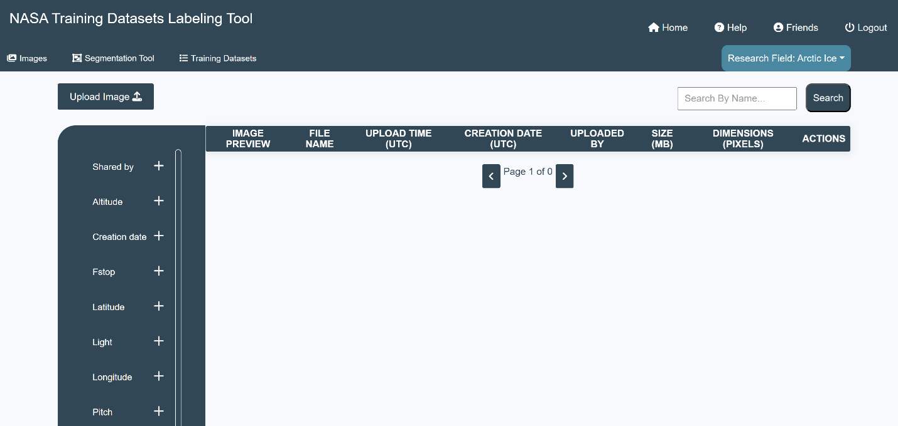

Note: If your installation is fresh, there will be no images displayed.  

**Setup Complete**

You’ve now successfully installed and configured ClassX on your Linux system.
